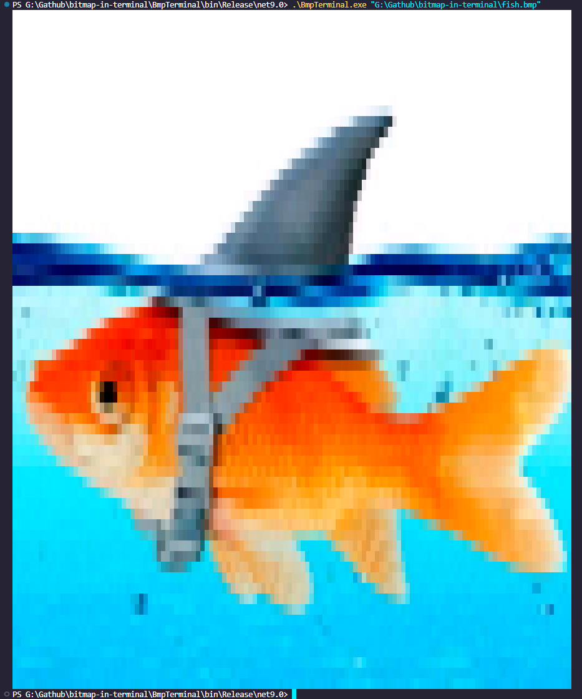
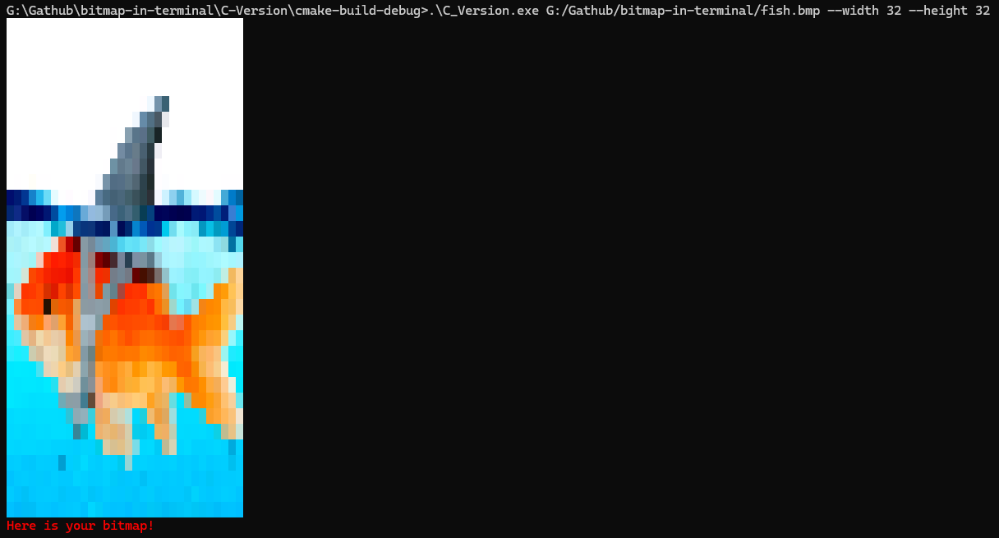

](https://opensource.org/licenses/MIT)
# bitmap-in-terminal
 
This is a simple C# program which renders a bitmap image in the terminal. It uses the `System.Drawing` library to load and process the image, and then outputs it using ANSI escape codes to display colors in the terminal.

## Usage
1. Clone the repository or download the source code.
2. Build the project using your preferred C# development environment (e.g., Visual Studio, .NET CLI).
3. Run the program and provide the path to the bitmap image you want to render in the terminal.
```bash
dotnet run -- path/to/your/image.bmp
```

## Example outputs
Here are some example outputs of bitmap images rendered in the terminal:

This is a simple example of a bitmap image rendered in the terminal. The program converts the image into a series of colored characters, allowing you to see the image directly in your terminal window.

This is another example of a bitmap image rendered in the terminal. However this was ran inside Visual Studio Code's integrated terminal.


## Notes
This was mainly a project made out of fun due to me having watched a youtube video about rending bitmaps in the terminal, and I wanted to give my own "twist" to it.

Yeah thats pretty much it.

## Update 1.5021y (I know this is a unique version number, but its life)
Anyways so basically with this update I made a C-Version of this program since I felt like the need to work on my C skills. With that said the C-Version is way faster due to me having added multithreading. At first it wasn't significantly faster, for instance 450x450 would take a while to render, but after adding multithreading it was significantly faster, now basically an instant. The C version also has flags this being --height and --width which you can use to specify the height and width of the output in the terminal. It also checks the most optimal thread count to use based on the system's hardware and uses that for the multithreading.

```bash
./bmp-to-terminal path/to/your/image.bmp --height 50 --width 50 
```


One idea I have for a future update is to add a generate bitmap image program so you don't have to make/find a bitmap image, and probably add multithreading and flags to the C# version.

## License
This project is licensed under the MIT License. See the [LICENSE](LICENSE) file for details


fish